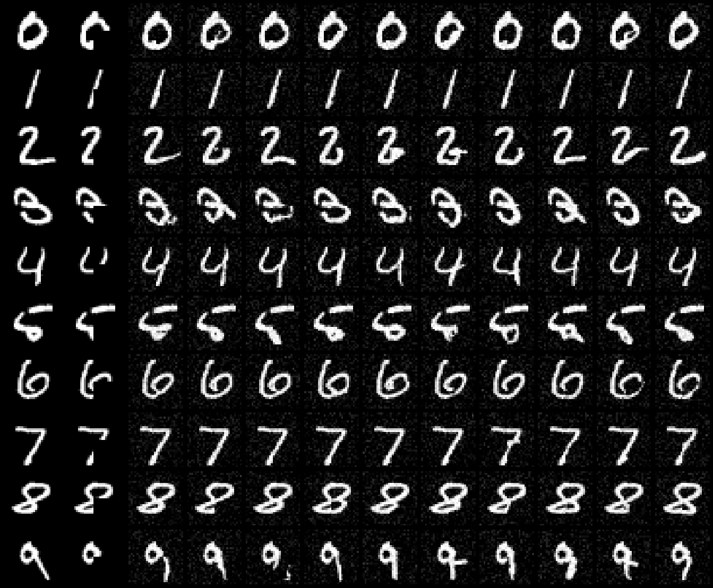
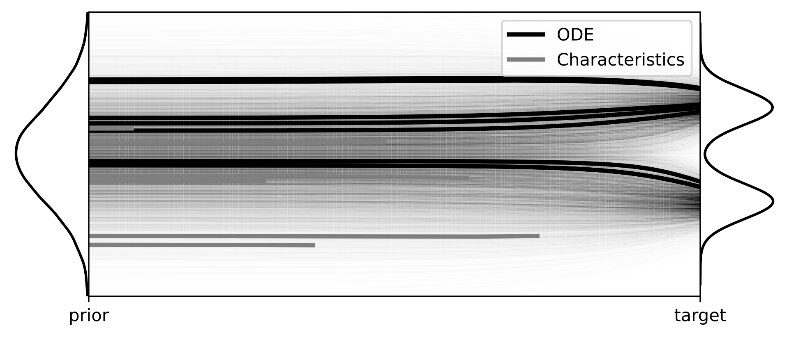

## Official Implementations of `Deep Conditional Generative Learning: Model and  Error Analysis`

### Introduction

We introduce Conditional Föllmer Flow, an **ODE** based generative method for sampling from a conditional distribution. 
We establish that the ODE is defined over the **unit time** interval, and under mild conditions, the velocity field and flow map of this ODE exhibit **Lipschitz** properties. 
Furthermore, we prove that the distribution of the generated samples converges to the underlying target conditional distribution with a certain convergence rate, providing a robust theoretical foundation for our approach. 
Our numerical experiments showcase its effectiveness across a range of scenarios, from standard nonparametric conditional density estimation problems to more intricate challenges such as image data.

<p align="center">

</p>

We also explore an one-step scheme to accelerate sampling process.

<p align="center">

</p> 

### Preparations

- Third-party softwares for comparison

    - [NNKCDE](https://github.com/lee-group-cmu/NNKCDE)
    - [FlexCoDE](https://github.com/rizbicki/FlexCoDE)

- Download MNIST dataset into `./data/MNIST` folder, refer to `torchvision`

- `pip install -r requirements` for dependencies

### Repository structure
```
.
|-- README.md
|-- asset
|   |-- demo.pdf
|   |-- mnist-class-cond.pdf
|   |-- mnist-example.pdf
|   |-- mnist-inpaint-1.pdf
|   |-- mnist-inpaint-2.pdf
|   |-- mnist-inpaint-3.pdf
|   |-- os-comparison.pdf
|   |-- wine_kde.pdf
|   `-- wine_prediction_interval.pdf
|-- class_cond.py # reproduce mnist-class-cond.pdf
|-- config # configurations folder
|   |-- ode_mnist.py # MNIST unconditional ver.
|   `-- ode_mnist_cond.py # MNIST conditional ver.
|-- demo.py # reproduce demo.pdf
|-- distill.py # reproduce os-comparison.pdf
|-- dsm.py # train unconditional MNIST denoising score matching estimator
|-- dsm_cond.py # train conditional MNIST denoising score matching estimator
|-- ema.py # Exponential Moving Average helper
|-- inpaint.py # reproduce mnist-inpaing-[1,2,3].pdf
|-- network.py # U-Net module
|-- os.py # train characteristic estimator
|-- requirements.txt 
|-- sde.py # SDE/ODE meta class
|-- simulation.py # reproduce Table 1
|-- thirdparty.py # reproduce third-party software results
`-- wine.py # reproduce wine_kde.pdf, wine_prediction_interval.pdf
```